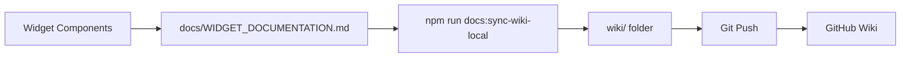

<div align="center">


# 🚀 Quantum Tab


### *The Ultimate Chrome Extension Dashboard*

[](https://chrome.google.com/webstore)
[](https://reactjs.org/)
[](https://www.typescriptlang.org/)
[](https://developer.chrome.com/docs/extensions/mv3/)

*Transform your new tab experience with a customizable, widget-powered dashboard that puts everything you need at your fingertips.*

[🎯 Features](#-features) • [🚀 Quick Start](#-quick-start) • [🛠️ Development](#️-development) • [📦 Installation](#-installation)

</div>

---

## ✨ **What Makes Quantum Tab Special?**

🎨 **Beautiful & Modern** - Sleek glass-morphism design with customizable backgrounds  
⚡ **Lightning Fast** - Built with React 18 and optimized for performance  
🧩 **Modular Widgets** - Drag, drop, and customize your perfect workspace  
🌐 **Multi-Language** - Full internationalization support (English, Afrikaans, Spanish)  
🔒 **Privacy First** - All data stored locally, no tracking, no servers  
🛡️ **Manifest V3** - Future-proof with the latest Chrome Extension standards

## 🎯 **Features**

<div align="center">

| 🕒 **Live Clock** | ⚡ **Quick Actions** | 🎨 **Background Manager** |
|:---:|:---:|:---:|
| Multi-timezone support<br/>Custom formats<br/>Real-time updates | Favorite website shortcuts<br/>Custom icons & labels<br/>One-click navigation | Upload custom backgrounds<br/>5MB file support<br/>Preview & restore |

| 🐙 **GitHub Guru** | 📋 **Azure DevOps Board** | 🌐 **Language Settings** |
|:---:|:---:|:---:|
| Repository-wide PR monitoring<br/>PAT authentication<br/>Auto-refresh insights | Kanban-style Azure Boards view<br/>Column filtering & search<br/>Auto refresh with provider PATs | Multi-language UI<br/>Instant switching<br/>Persistent preferences |

| 🏃 **Sprint Number** | 🗓️ **Quarter Indicator** | ⚙️ **Settings Hub** |
|:---:|:---:|:---:|
| Track sprint cycles<br/>Auto-calculate sprint dates<br/>Multiple sprint tracking | Fiscal calendar tracking<br/>Auto quarter calculation<br/>Custom start dates | Manage AI + GitHub providers<br/>Set widget defaults<br/>Centralized configuration |

</div>

### 🔥 **Core Technologies**

- 🚀 **React 18** - Modern functional components with hooks
- 📘 **TypeScript** - Type-safe development experience  
- ⚡ **Webpack** - Optimized build system with hot reload
- 🎨 **CSS Modules** - Component-scoped styling
- 🌍 **react-i18next** - Full internationalization support
- 🔍 **ESLint & Prettier** - Code quality and formatting

## 🚀 **Quick Start**

```bash
# 📦 Install dependencies
npm install

# 🔨 Build for development
npm run dev

# 🏗️ Build for production  
npm run build

# 🧹 Format code
npm run format
```

### 📦 **Installation**

1. **📁 Download** - Clone or download this repository
2. **🔨 Build** - Run `npm install && npm run build`
3. **🌐 Load** - Open `chrome://extensions/`, enable Developer mode
4. **📂 Install** - Click "Load unpacked" and select the `dist` folder
5. **🎉 Enjoy** - Open a new tab and customize your dashboard!

---

## 🏗️ **Project Architecture**

<details>
<summary>📁 <strong>Project Structure</strong></summary>

```
quantum-tab/
├── 📁 src/
│   ├── 🎨 newtab/               # New tab dashboard
│   │   ├── index.tsx           # Main dashboard entry
│   │   ├── NewTab.tsx          # Dashboard component
│   │   └── newtab.css          # Dashboard styles
│   ├── 🧩 components/          # Reusable widgets
│   │   ├── ClockWidget.tsx     # Live clock widget
│   │   ├── GitHubWidget.tsx    # GitHub integration
│   │   ├── LocaleWidget.tsx    # Language settings
│   │   └── ...                 # More widgets
│   ├── 🌍 locales/             # Internationalization
│   │   ├── en.json            # English translations
│   │   └── af.json            # Afrikaans translations
│   │   └── es.json            # Spanish translations
│   ├── 🔧 background/          # Extension background
│   ├── 📝 content/             # Content scripts
│   ├── 🎯 types/               # TypeScript definitions
│   └── 🛠️ utils/               # Utility functions
├── 🖼️ public/icons/            # Extension icons
├── 📄 manifest.json           # Extension manifest
└── ⚙️ webpack.config.js        # Build configuration
```

</details>

## 🛠️ **Development**

### 📋 **Prerequisites**

- 🟢 **Node.js** (v16 or later)
- 📦 **npm** or **yarn**
- 🌐 **Chrome Browser** (for testing)

### 🚀 **Development Workflow**

<details>
<summary>💻 <strong>Local Development Setup</strong></summary>

```bash
# 1️⃣ Clone the repository
git clone https://github.com/YourUsername/quantum-tab.git
cd quantum-tab

# 2️⃣ Install dependencies
npm install

# 3️⃣ Start development server
npm run dev

# 4️⃣ Open Chrome Extensions
# Navigate to: chrome://extensions/

# 5️⃣ Load the extension
# Enable "Developer mode" → Click "Load unpacked" → Select /dist folder
```

</details>

### 🔄 **Hot Reload Development**

1. 🔥 **Start dev mode** - `npm run dev` (watches for file changes)
2. 💾 **Make changes** - Edit any source file
3. 🔄 **Auto-rebuild** - Webpack automatically rebuilds
4. 🔃 **Reload extension** - Click reload button in `chrome://extensions/`
5. ✨ **Test changes** - Open new tab to see updates

### 📜 **Available Scripts**

| Command | Description | Usage |
|:--------|:------------|:------|
| 🏗️ `npm run build` | Production build with optimization | Release builds |
| 🔨 `npm run dev` | Development build with file watching | Active development |
| 🧹 `npm run lint` | ESLint code quality checks | Code review |
| ✨ `npm run format` | Prettier code formatting | Code cleanup |
| 🔍 `npm run type-check` | TypeScript type validation | Type safety |
| 📚 `npm run docs:sync-wiki-local` | Generate wiki documentation locally | Local wiki updates |
| 📖 `npm run docs:sync-wiki` | Generate wiki documentation for CI/CD | Production wiki sync |

---

## 📖 **Documentation & Wiki**

<div align="center">

**Comprehensive widget documentation automatically generated from source code**

</div>

### 🎯 **Wiki Documentation System**

Quantum Tab uses an automated documentation generation system that converts widget definitions into comprehensive GitHub Wiki pages. All widget documentation is centralized in [`docs/WIDGET_DOCUMENTATION.md`](docs/WIDGET_DOCUMENTATION.md) and automatically synced to the [GitHub Wiki](https://github.com/Ruandv/Quantum-Tab/wiki).

### 🔄 **How It Works**

<details>
<summary>📝 <strong>Documentation Workflow</strong></summary>



1. **📄 Source Documentation** - Widget properties and descriptions are maintained in `docs/WIDGET_DOCUMENTATION.md`
2. **🔧 Local Generation** - Run `npm run docs:sync-wiki-local` to generate individual wiki pages
3. **📁 Wiki Folder** - Generated markdown files are saved to the local `wiki/` folder
4. **🔄 Git Sync** - The `wiki/` folder is a Git submodule linked to the GitHub Wiki repository
5. **🌐 Publish** - Commit and push changes to automatically update the live GitHub Wiki

</details>

<details>
<summary>🛠️ <strong>Local Wiki Development</strong></summary>

#### **Setting Up Local Wiki**

```bash
# 1️⃣ Clone the wiki repository
cd wiki
git clone https://github.com/Ruandv/Quantum-Tab.wiki.git .

# 2️⃣ Generate wiki pages from documentation
cd ..
npm run docs:sync-wiki-local

# 3️⃣ Review generated files
cd wiki
ls -la  # See all generated .md files

# 4️⃣ Commit and push changes
git add .
git commit -m "docs: update widget documentation"
git push origin master
```

#### **Documentation Structure**

The documentation generator automatically creates:
- **Home.md** - Main wiki landing page with widget index
- **[widget-name].md** - Individual pages for each widget
- **timezones.md** - Time zone reference for LiveClock widget

</details>

<details>
<summary>📚 <strong>Adding New Widget Documentation</strong></summary>

When creating a new widget, add its documentation to `docs/WIDGET_DOCUMENTATION.md`:

```markdown
### YourNewWidget
- **Description**: Brief description of what the widget does
- **Usage**: How and when to use this widget

#### Properties
- **propertyName**: Description of the property and its purpose
- **anotherProperty**: Another property description
```

Then regenerate the wiki:

```bash
npm run docs:sync-wiki-local
cd wiki
git add .
git commit -m "docs: add YourNewWidget documentation"
git push
```

</details>

<details>
<summary>🤖 <strong>CI/CD Documentation Pipeline</strong></summary>

The repository includes a GitHub Action workflow (`.github/workflows/sync-docs-to-wiki.yml`) that automatically:

1. **Triggers on push** to the main branch when `docs/WIDGET_DOCUMENTATION.md` changes
2. **Generates wiki pages** using `npm run docs:sync-wiki`
3. **Publishes to Wiki** using the official GitHub Wiki Action
4. **Updates live docs** without manual intervention

#### **Production Sync Command**

```bash
npm run docs:sync-wiki
```

This command generates wiki files in `wiki/` folder for CI/CD deployment.

</details>

### 📑 **Documentation Best Practices**

✅ **Keep it updated** - Update `docs/WIDGET_DOCUMENTATION.md` when modifying widget properties  
✅ **Test locally** - Use `npm run docs:sync-wiki-local` to preview changes before pushing  
✅ **Follow structure** - Maintain consistent formatting for all widget documentation  
✅ **Include examples** - Add usage examples and common configuration patterns  
✅ **Alphabetical properties** - List widget properties in alphabetical order

### 🔗 **Quick Links**

- 📖 [View Live Wiki](https://github.com/Ruandv/Quantum-Tab/wiki)
- 📝 [Documentation Source](docs/WIDGET_DOCUMENTATION.md)
- 🔄 [Wiki Sync Workflow](docs/WIKI_SYNC_WORKFLOW.md)

---

## 🧩 **Widget Gallery**

<div align="center">

### **Available Dashboard Widgets**

</div>

<details>
<summary>🕒 <strong>Live Clock Widget</strong></summary>

**Perfect for global teams and timezone management**

✨ **Features:**
- 🌍 Multiple timezone support with auto-detection
- 📅 Customizable date and time formats  
- 🔄 Real-time updates every second
- 📏 Resizable widget dimensions
- 🎨 Beautiful glass-morphism design

**Multiple Instances:** ✅ Yes (track multiple timezones)

</details>

<details>
<summary>⚡ <strong>Quick Actions Widget</strong></summary>

**One-click access to your favorite websites**

✨ **Features:**
- 🎯 Customizable emoji icons and labels
- 🚀 Direct website navigation
- 🎛️ Drag-and-drop management
- ➕ Unlimited button creation
- 🔗 Smart URL validation

**Multiple Instances:** ✅ Yes (create themed button groups)  
**Default Buttons:** GitHub, MyBroadband

</details>

<details>  
<summary>🎨 <strong>Background Manager Widget</strong></summary>

**Personalize your dashboard with custom backgrounds**

✨ **Features:**
- 📁 Upload custom images (PNG, JPG, JPEG, GIF, WebP)
- 👁️ Live preview before applying
- 🔄 Restore default gradient anytime
- 🗑️ Remove backgrounds with one click
- 📊 5MB file size limit

**Multiple Instances:** ❌ No (single background manager)

</details>

<details>
<summary>🐙 <strong>GitHub Integration Widget</strong></summary>

**Monitor your repositories and pull requests**

✨ **Features:**
- 📊 Real-time pull request monitoring
- 🔐 PAT token authentication for private repos
- 🏷️ PR status indicators (Open, Merged, Closed, Draft)
- 🔄 Auto-refresh pull request data
- 📈 Repository information display

**Multiple Instances:** ✅ Yes (monitor multiple repositories)  
**Requirements:** GitHub Personal Access Token for private repos

</details>

<details>
<summary>🌐 <strong>Language Settings Widget</strong></summary>

**Multi-language interface support**

✨ **Features:**
- 🌍 Support for multiple languages
- ⚡ Instant language switching (no restart needed)
- 💾 Persistent locale preferences in Chrome storage
- 🏳️ Visual language indicators with flag emojis
- 🔒 Read-only display when widget is locked

**Multiple Instances:** ❌ No (single language settings)  
**Available Languages:** English , Afrikaans , Spanish 

</details>

<details>
<summary>🏃 <strong>Sprint Number Widget</strong></summary>

**Track your agile sprint cycles with automatic calculations**

✨ **Features:**
- 📅 Configure sprint start date, length, and current sprint number
- 🔄 Automatic sprint calculation based on elapsed days
- 📊 Display current sprint number with start/end dates
- ⏰ Live updates at midnight each day
- 🎯 Configurable sprint length (default: 14 days)
- 📈 Perfect for agile teams and project management

**Multiple Instances:** ✅ Yes (track multiple sprint schedules)  
**Configuration:** Set once when adding widget  
**Calculation:** `(Today - StartDate) / SprintLength + BaseSprint`

</details>

---

## 🏛️ **Architecture & APIs**

<div align="center">

### **Built on Modern Chrome Extension Standards**

</div>

<details>
<summary>🚀 <strong>Extension Infrastructure</strong></summary>

#### 🎨 **New Tab Dashboard**
- Modern React-based UI with glass-morphism design
- Drag-and-drop widget management system
- Full internationalization (i18n) support
- Responsive design with CSS modules
- Real-time data synchronization

#### ⚙️ **Background Service Worker**
- Extension lifecycle event handling
- Message passing between components
- Badge updates and extension state management
- Website visit tracking for analytics
- Persistent data management

#### 📝 **Content Script Integration**
- Seamless page interaction capabilities
- Website visit detection and counting
- Communication bridge between web pages and extension
- Privacy-focused data collection

</details>

<details>
<summary>🔌 <strong>Chrome APIs Integration</strong></summary>

| API | Usage | Purpose |
|:---|:------|:--------|
| 🔖 `chrome.tabs` | Tab management & queries | New tab functionality |
| 💾 `chrome.storage` | Data persistence | Widget configs & user data |
| 📨 `chrome.runtime` | Message passing | Component communication |
| 🎯 `chrome.action` | Icon & badge management | Extension UI updates |
| 📁 **File System APIs** | Image upload processing | Background customization |
| 🌍 **i18n APIs** | Multi-language support | Localization framework |

</details>

---

## 🤝 **Contributing**

<div align="center">

**Help make Quantum Tab even better!**

</div>

### 📋 **Guidelines**

1. 🎨 **Code Style** - Follow ESLint and Prettier configurations
2. 📝 **Commit Messages** - Use meaningful, descriptive commits
3. 🧪 **Testing** - Test all changes before submitting
4. 📚 **Documentation** - Update docs for new features
5. 🔍 **Code Review** - All PRs require review

### 🛠️ **Development Stack**

<div align="center">

| Frontend | Extension | Tooling |
|:--------:|:---------:|:-------:|
|  |  |  |
|  |  |  |
|  |  |  |
|  |  |  |

</div>

---

<div align="center">

### 🌟 **Star this repo if you find it useful!**

**Made with ❤️ for the Chrome Extension community**

[](https://github.com/YourUsername/quantum-tab/stargazers)
[](https://github.com/YourUsername/quantum-tab/network/members)

[Report Bug](https://github.com/YourUsername/quantum-tab/issues) • [Request Feature](https://github.com/YourUsername/quantum-tab/issues) • [Contribute](https://github.com/YourUsername/quantum-tab/pulls)

</div>